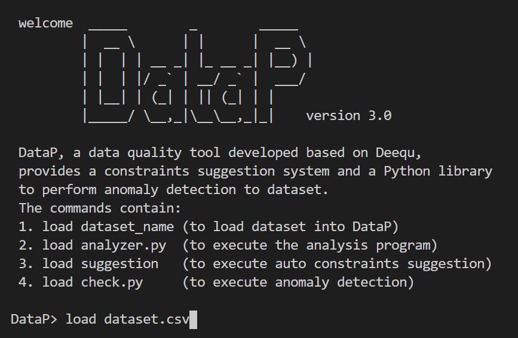

# DataP

DataP, a Python data quality tool which is based on Deequ, solves the problems of user participation and complex environment settings, and still provides with the functions of constraints suggestion and quarantine system.

DataP, a data quality tool designed on the basis of Deequ, has functions of analysis, auto constraint suggestion, and anomaly detection. The language used by DataP is Python in order to meet the needs of widespread use. In addition, DataP also minimizes the need for environment settings. Users only need to install the prettytable library to run the program on the terminal. The instructions for running the program are also very simple, which makes it easier for users to operate this tool.

The operation process of DataP is very simple and clear, and it is only divided into four instructions: load data, load analyzer.py, load suggestions, and load check.py.

## 1. Load data

The function of load data is to import the dataset into DataP, and then DataP will conduct a preliminary analysis of the dataset, obtain and store the basic information of each column, such as the number of positive numbers, the number of nulls, and the prediction of the data type. After that, the basic information of the dataset will be displayed on the terminal as root.

## 2. Load analyzer.py

The function of load analyzer.py is based on the conditions in analyzer.py. DataP will execute the called function and display the analysis result on the terminal in table format. The entire analysis process will not be terminated due to any errors in the column. For example, when the average is calculated but there is a string in the column, DataP will actively isolate it and record it in the analysis table. This method allows users to operate DataP smoothly without being interrupted.

## 3. Load suggestions

Load suggestions are derived from Deequ's classic feature, which can automatically provide users with the most suitable constraints for each column, and these constraints can be used in check.py. DataP's auto constraints suggested model is based on the information in each column and makes certain assumptions based on this information. When the assumption meets the standard, it will assume that the assumption is valid, and then propose the assumption to the user. For example, when more than 90% of the values in the column are integers, then the constraints of "the values in this column are all integers" will be made for the column.

## 4. Load check.py

Load check.py is the last feature of DataP, and it is also the step to actually perform data quality detection. The check.py completed by the user according to the suggestion or by himself will verify the selected column according to each condition in the file. When the column meets the condition, it will display "Success", and when the column does not meet the condition, it will display "Fail" and list the non-compliant rows. When other errors occur, such as the column does not exist, it will display "Error". All the results will be aggregated into the table as a final report.
